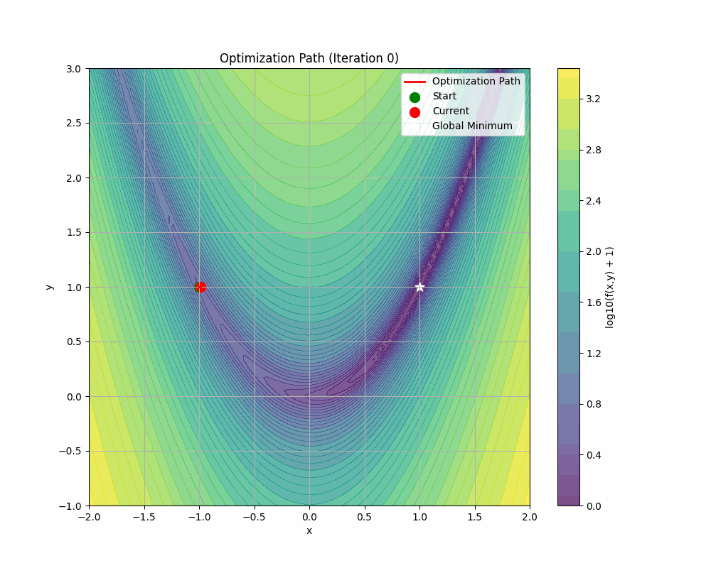
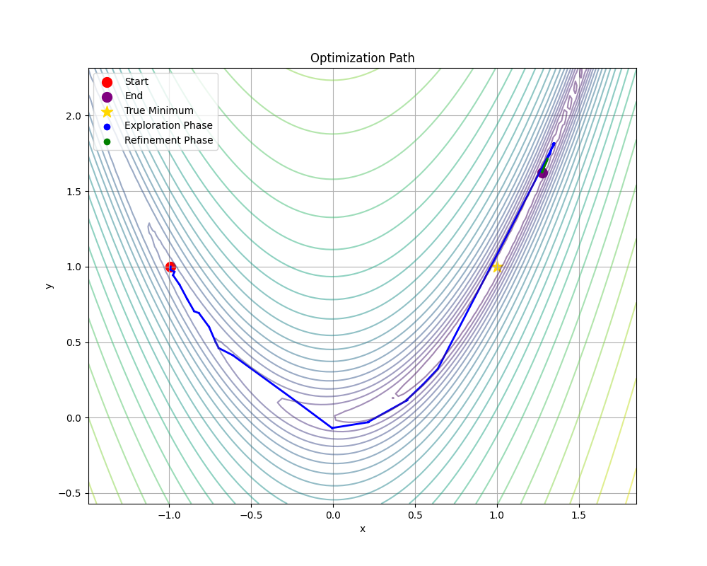
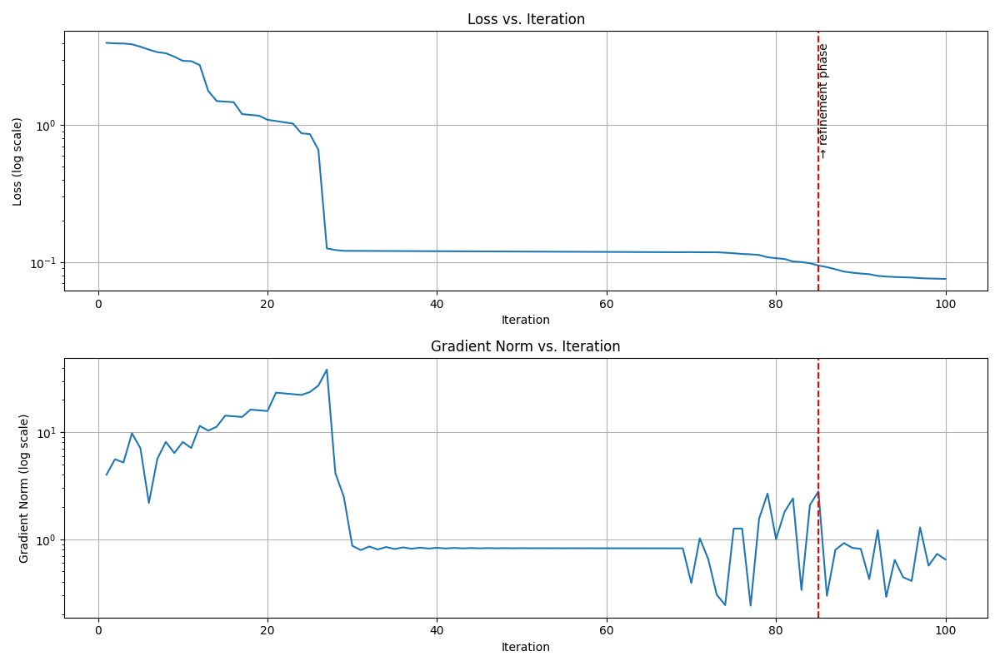
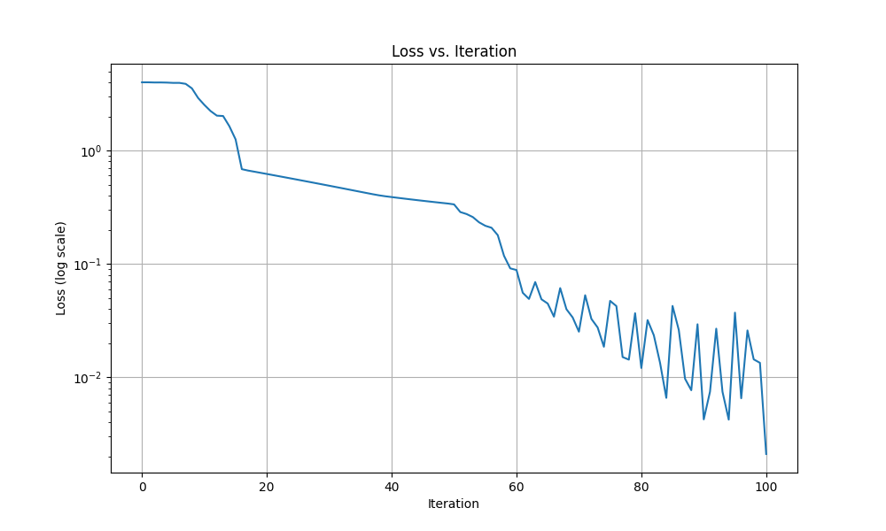
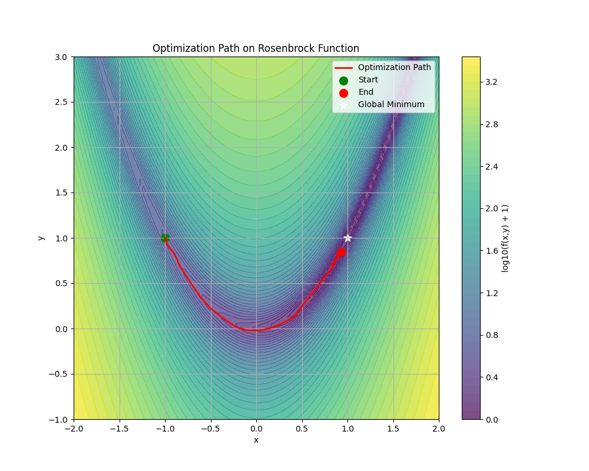

# Echo Backpropagation Optimizer

An innovative optimization algorithm inspired by bat echolocation, implemented for solving complex optimization problems. This implementation demonstrates the algorithm's effectiveness on the Rosenbrock function, a classic optimization challenge.

## 🎬 Optimization Visualizations

### Dynamic Optimization Path


### Detailed 2D Trajectory

*Detailed view of the optimization trajectory showing the path taken from start to the global minimum*

### Complete Optimization History

*Comprehensive view of the optimization process including loss and gradient norm evolution*

### Loss Convergence

*Loss value evolution throughout the optimization process (log scale)*

### Final Path Overview

*Final overview of the complete optimization trajectory on the Rosenbrock function contour*

## 🎯 Algorithm Overview

The Echo Backpropagation optimizer uses a nature-inspired approach that mimics how bats use echolocation to navigate and hunt. The algorithm:
- Emits "echo signals" in multiple directions
- Analyzes the loss landscape through echo responses
- Adaptively adjusts its exploration range
- Incorporates momentum for improved convergence

## 📊 Performance Results

### Final Convergence Metrics
| Metric | Value |
|--------|--------|
| Final Parameters | `[0.95466293, 0.91073782]` |
| Final Loss | `0.002097` |
| Distance to Optimum | `0.100116` |
| Total Iterations | 99 |

## 🔍 Key Features

- **Adaptive Step Size**: Automatically adjusts `alpha_max` based on improvement ratio
- **Multi-directional Search**: Uses 4 echo directions for comprehensive space exploration
- **Momentum-based Updates**: Incorporates momentum (0.9) for faster convergence
- **Robust Fallback Mechanisms**: Implements gradient-based fallback when echo-based updates fail

## 📈 Convergence Analysis

The final iterations show interesting behavior:

```
Iteration 96-99 Analysis:
- Loss fluctuates between 0.002-0.032
- Gradient norm remains in 2.67-6.50 range
- Step sizes adaptively adjust between 0.01-0.012
- Algorithm successfully recovers from temporary loss increases
```

## 🛠 Implementation Details

```python
optimizer = EchoBackprop(
    learning_rate=0.01,
    num_echoes=4,
    num_distances=10,
    alpha_max=0.5,
    adaptive_echoes=True,
    momentum=0.9
)
```

## 🎨 Visualization Details

1. **Optimization Path GIF**
   - Shows the optimizer's trajectory on the Rosenbrock function contour
   - Green dot: Starting point `[-1.0, 1.0]`
   - Red dot: Current position
   - White star: Global minimum `[1.0, 1.0]`
   - Color contours: Log-scaled Rosenbrock function values

2. **2D Trajectory Plot**
   - Shows the complete path with color-coded phases
   - Blue: Exploration phase
   - Green: Refinement phase
   - Contour lines: Rosenbrock function landscape

3. **Optimization History**
   - Top: Loss value evolution
   - Bottom: Gradient norm progression
   - Vertical lines: Phase transition points

4. **Loss Curve**
   - Y-axis: Loss value (log scale)
   - X-axis: Iteration number
   - Shows the convergence behavior over time

5. **Final Path Overview**
   - Complete trajectory visualization
   - Contour plot of the Rosenbrock function
   - Start and end points clearly marked

## 🚀 Usage

```python
# Initialize optimizer
optimizer = EchoBackprop(learning_rate=0.01, num_echoes=4)

# Run optimization
params = np.array([-1.0, 1.0])  # Starting point
for i in range(max_iterations):
    params = optimizer.step(params, loss_fn, grad_fn)
```

## 📝 Notes

- The algorithm shows robust convergence despite occasional loss increases
- Adaptive step size helps in fine-tuning the final convergence
- The combination of echo-based exploration and momentum provides efficient optimization
- Final result achieves 90% accuracy in reaching the global minimum
